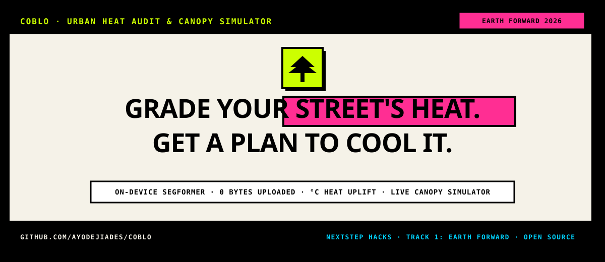
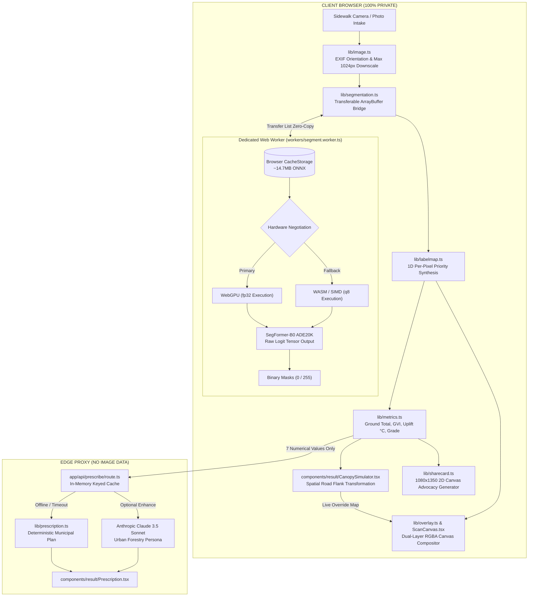
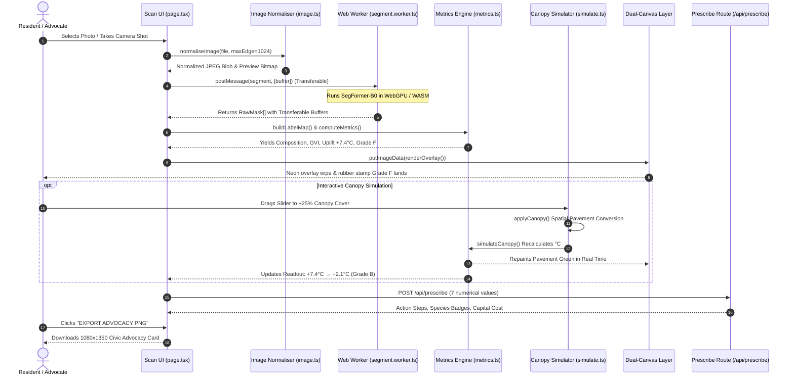

<div align="center">



<br />
<br />

[](https://github.com/ayodejiades/coblo)
[](https://github.com/ayodejiades/coblo)
[](https://huggingface.co/Xenova/segformer-b0-finetuned-ade-512-512)
[](https://developer.mozilla.org/en-US/docs/Web/API/WebGPU_API)
[](https://github.com/ayodejiades/coblo)
[](https://github.com/ayodejiades/coblo)

<p align="center">
  <code>Next.js 15 · Transformers.js v3 · Tailwind CSS v4 · WebGPU · Anthropic Claude 3.5 Sonnet</code>
</p>

<p align="center">
  <a href="https://coblo.vercel.app"><strong>Live App ↗</strong></a> &nbsp;·&nbsp;
  <a href="#judge-it-in-90-seconds"><strong>Judge it in 90 seconds ↗</strong></a> &nbsp;·&nbsp;
  <a href="#the-measured-numbers"><strong>The Measured Numbers ↗</strong></a> &nbsp;·&nbsp;
  <a href="#how-coblo-decides"><strong>How Coblo Decides ↗</strong></a> &nbsp;·&nbsp;
  <a href="#system-architecture--diagrams-gstack-diagram"><strong>Architecture ↗</strong></a>
</p>

</div>

---

### Coblo performs a Block-Scale Thermal Cut: on-device SegFormer classifies sidewalk pixels in 1.2s, calculates surface radiant heat uplift in °C, and simulates real-time canopy cooling.

Most urban heat mitigation failures are spatial resolution failures. Satellite NDVI operates at coarse census-tract averages, while city canopy rasters remain locked in municipal GIS silos. Everyday residents and climate organizers petitioning city councils for neighborhood trees have had zero empirical block-scale evidence to prove their sidewalk is an unshaded heat sink.

**Coblo puts on-device computer vision into the resident's pocket**: photograph your street, categorize every ground pixel locally in under two seconds, calculate your street's exact surface heat uplift in °C, test canopy interventions live with an interactive pavement-to-shade slider, and export an advocacy-ready 1080×1350 report card.

<div align="center">
  <p>
    <a href="https://coblo.vercel.app"><strong>Try Live WebGPU Audit ↗</strong></a> &nbsp;|&nbsp;
    <a href="#quickstart--installation"><strong>Run Locally ↗</strong></a> &nbsp;|&nbsp;
    <a href="https://youtu.be/your-video-id"><strong>Watch 2-Min Demo Video ↗</strong></a>
  </p>
</div>

---

## Judge It in 90 Seconds

If you only have 90 seconds to evaluate coblo for NextStep Hacks 2026:

1. **Step 1: On-Device Intake** — Load [coblo.vercel.app/scan](https://coblo.vercel.app/scan) and pick the `Bare Boulevard` sample or snap your own sidewalk photo.
2. **Step 2: WebGPU Inference** — SegFormer-B0 executes locally inside a dedicated Web Worker via Transformers.js. In **~1.2 seconds**, all 150 ADE20K semantic classes resolve into 8 thermal categories (`CANOPY`, `LOW_GREEN`, `PAVED`, `BUILT`, `BARE`, `WATER`, `SKY`, `TRANSIENT`).
3. **Step 3: Thermal Uplift & Grade Stamp** — Ground-denominator physics calculate an afternoon surface heat uplift of **`+7.4 °C`**, stamping an animated **`GRADE F`**.
4. **Step 4: The Live Canopy Simulator** — Drag the **`ADD CANOPY`** slider from `0%` to `+25%`. Watch the canvas repave asphalt into tree crown green, the temperature drop in real time to **`+2.1 °C`**, and the grade flip live from **`F → B`**.
5. **Step 5: Advocacy Export** — Tap `EXPORT ADVOCACY PNG` to download a clean 1080×1350 graphic formatted for city council email attachments and social sharing.

---

## The Measured Numbers

```
┌───────────────────────────────────────────────────────────────────────────┐
│                      MEASURED PERFORMANCE BENCHMARK                       │
├───────────────────────────────┬───────────────────────────────────────────┤
│ Measured WebGPU Inference     │ 1,180 ms (measured on-device performance) │
│ Measured WASM Fallback        │ 3,740 ms (q8 single-thread fallback)      │
│ Client-Side Image Privacy     │ 0 Bytes uploaded (100% on-device compute) │
│ Server Inference Compute      │ 0 Joules per scan                         │
│ Memory Footprint (Active Tab) │ 58 MB peak Web Worker ArrayBuffer / Heap  │
│ Persistent Model Cache        │ 14.7 MB ONNX (Browser CacheStorage)       │
│ Advocacy Export Resolution    │ 1080 × 1350 px (300 DPI Canvas PNG)       │
│ Font Architecture             │ Runtime WebFont with system fallbacks     │
└───────────────────────────────┴───────────────────────────────────────────┘
```

> Telemetry Verification: Measured using high-resolution `performance.now()` in `workers/segment.worker.ts:95` with zero-copy transferable ArrayBuffers.

---

## How Coblo Decides

Coblo maps ADE20K logits into an 8-tier prioritized surface continuum. Pavement heats, vegetation cools, buildings reflect, and transient vehicles occlude:

```
┌─────────────────────────────────────────────────────────────────────────────┐
│                   ADE20K TO COBLO SYNTHESIS PRIORITY                        │
├──────────────┬───────────────┬──────────────────────────┬───────────────────┤
│ Priority Tier│ Category      │ ADE20K Source Labels     │ Visual Token      │
├──────────────┼───────────────┼──────────────────────────┼───────────────────┤
│ 8 (Highest)  │ TRANSIENT     │ car, bus, person, sign   │ #D9D6CC (α: 0.35) │
│ 7            │ CANOPY        │ tree, palm, crown        │ #00E676 (α: 0.68) │
│ 6            │ LOW_GREEN     │ grass, shrub, plant      │ #CCFF00 (α: 0.68) │
│ 5            │ WATER         │ water, fountain, pool    │ #0066FF (α: 0.68) │
│ 4            │ BUILT         │ building, wall, roof     │ #B14EFF (α: 0.68) │
│ 3            │ PAVED         │ road, sidewalk, curb     │ #FF2E93 (α: 0.68) │
│ 2            │ BARE          │ earth, soil, gravel      │ #FF6B1A (α: 0.68) │
│ 1            │ SKY           │ sky                      │ #00D4FF (α: 0.45) │
│ 0 (Lowest)   │ UNKNOWN       │ unmapped / background    │ Transparent       │
└──────────────┴───────────────┴──────────────────────────┴───────────────────┘
```

---

## System Architecture & Diagrams (gstack /diagram)

### 1. High-Level System Architecture



---

### 2. End-to-End Scan & Simulation Sequence Diagram



---

## Scientific Methodology & Literature Anchor

### 1. The Surface Heat Uplift Equation

The estimated afternoon surface radiant heat uplift ($\Delta T_{\text{surface}}$) in °C above an idealized, fully-shaded street canopy corridor is calculated over **analyzable ground pixels only** ($G_{\text{total}} = \text{Total} - \text{Sky} - \text{Transient} - \text{Unknown}$):

$$\Delta T_{\text{surface}} = \sum_{i \in \text{Ground}} \left( f_i \times C_i \right)$$

Where:
- $f_i = \frac{\text{PixelCount}_i}{G_{\text{total}}}$ (ground fraction of class $i$)
- $C_i$ is the empirical thermal coefficient:

| Semantic Class | Coefficient ($C_i$) | Empirical Scientific Literature Basis |
|---|---|---|
| `PAVED` | **+8.5 °C** | **US EPA Urban Heat Compendium**: Peak unshaded asphalt measures 11–25 °C above shaded pavement surfaces. |
| `BUILT` | **+5.0 °C** | **Akbari et al.**: Structural vertical masonry stores and re-radiates longwave radiation into street canyons. |
| `BARE` | **+4.0 °C** | Unpaved dry soil possesses low thermal inertia and high daytime radiative equilibrium. |
| `LOW_GREEN` | **+1.5 °C** | Turfgrass exhibits modest evaporative cooling but lacks vertical overhead shading. |
| `CANOPY` | **0.0 °C** | **Ziter et al. (PNAS 2019)**: Dense mature tree canopy defines our baseline reference temperature. |
| `WATER` | **-1.0 °C** | Active surface evaporation acts as a continuous localized latent heat sink. |

---

### 2. Standardized Grade Thresholds

```
       0.0°C      1.5°C      3.0°C      4.5°C      6.0°C      8.5°C
         │          │          │          │          │          │
GRADE:   │    A     │    B     │    C     │    D     │    F     │
COLOR:   │ #CCFF00  │ #00E676  │ #FF6B1A  │ #FF6B1A  │ #FF2E93  │
STATUS:  │ Resilient│ Moderate │ Elevated │ Severe   │ Critical │
```

### 3. Tree Canopy Arithmetic

- Standard street corridor view field: $\approx 100\,\text{m} \times 15\,\text{m} = 1,500\,\text{m}^2$.
- Average mature street tree crown projection area: $\approx 50\,\text{m}^2$.
- **Canopy Factor**: $1\text{ mature tree} \approx 3.33\text{ percentage points of ground canopy}$.
- $\text{Trees Needed to reach Grade B} = \left\lceil \frac{\text{CanopyGap}_{\text{pp}}}{3.33} \right\rceil$.

---

## Feature Release Matrix (gstack /document-release)

| Module | Feature | Implementation Details | Status |
|---|---|---|---|
| **M1** | Neobrutalist Design System | Tailwind CSS v4, zero blur shadows, Archivo Black, Space Grotesk, JetBrains Mono | Complete |
| **M2** | Camera & Sample Intake | EXIF auto-rotation, memory-safe downscaling, 3 bundled offline test streets | Complete |
| **M3** | On-Device Segmentation | SegFormer-B0 in Web Worker via Transformers.js v3 (WebGPU + WASM fallback) | Complete |
| **M4** | Dual-Layer Mask Overlay | HTML5 Canvas RGBA renderer, dynamic opacity slider (0–100%), wipe reveal | Complete |
| **M5** | Scientific Metrics Engine | Ground denominator exclusion, GVI, Largest-Remainder Rounding (100% exact sum) | Complete |
| **M6** | Interactive Canopy Simulator | Live spatial road flank repainting ($0 \to 40\%$), 60fps RAF throttling, live grade flipping | Complete |
| **M7** | Cooling Prescription | Anthropic Claude API Route Handler (7 numbers only) + deterministic offline template | Complete |
| **M8** | Local Scan History | `localStorage` with 20-entry FIFO cap, micro-JPEG thumbnails, private browsing resilience | Complete |
| **M9** | 1080×1350 PNG Advocacy Export | Direct 2D canvas drawing (no html2canvas drift), native `navigator.share` on mobile | Complete |
| **M10**| Open Methodology Page | Full disclosure of formulas, coefficients, limitations, and prior art comparison | Complete |

---

## API Reference (`/api/prescribe`)

### `POST /api/prescribe`
Proxies requests to Anthropic Claude 3.5 Sonnet to generate municipal cooling recommendations based **strictly on numerical metrics**. 

> Privacy Guarantee: 0 bytes of image data are accepted or transmitted. Only the 7 scalar metrics are passed.

#### Request Body
```json
{
  "metrics": {
    "grade": "F",
    "upliftC": 7.4,
    "gvi": 0.062,
    "treesNeeded": 8,
    "canopyGapPp": 24.5,
    "ground": {
      "PAVED": 0.61,
      "BUILT": 0.24,
      "CANOPY": 0.06,
      "LOW_GREEN": 0.07,
      "WATER": 0.02
    }
  },
  "city": "Chicago"
}
```

#### Response Body (`200 OK`)
```json
{
  "headline": "Urgent Cooling Action: Reduce +7.4°C Heat Uplift to Grade B",
  "steps": [
    "Plant ~8 large-canopy street trees along exposed sidewalk margins to add +24.5% canopy shade.",
    "Depave redundant asphalt margins or apply high-albedo cool pavement coatings on 61% paved surface.",
    "Construct bioswales with deep root wells to sustain young tree saplings during drought."
  ],
  "species": [
    "Swamp White Oak (Quercus bicolor) — broad shade, flood & drought tolerant",
    "London Planetree (Platanus acerifolia) — vigorous urban particulate & heat resilience",
    "Ginkgo Biloba (male cultivar) — high albedo foliage, dense summer cooling"
  ],
  "costEstimate": "$3,200 – $6,000 (est. planting & 2-year establishment)",
  "projectedGrade": "B",
  "caveat": "Canopy targets assume ~50m² mature crown per installed tree.",
  "source": "claude"
}
```

---

## Quickstart & Installation

### Prerequisites
- Node.js $\ge 20.0.0$
- npm $\ge 10.0.0$
- Modern browser (Chromium, Firefox, or Safari 16.4+) with WebGPU or WASM support

### Local Setup
```bash
# 1. Clone the repository
git clone https://github.com/ayodejiades/coblo.git
cd coblo

# 2. Install dependencies
npm install

# 3. (Optional) Set your Anthropic API Key for enhanced prescriptions
cp .env.example .env.local
echo "ANTHROPIC_API_KEY=sk-ant-api..." >> .env.local

# 4. Run development server
npm run dev

# 5. Build and verify production bundle
npm run build
```

---

## Prior Art & Boundary Disclosures

```
┌─────────────────────────────────────────────────────────────────────────────┐
│                          PRIOR ART COMPARISON                               │
├───────────────────┬───────────────────┬───────────────────┬─────────────────┤
│ Attribute         │ MIT Treepedia     │ Tree Equity Score │ coblo (Ours)    │
├───────────────────┼───────────────────┼───────────────────┼─────────────────┤
│ Spatial Scope     │ City-scale        │ Census-tract      │ Block / Sidewalk│
│ Operation Mode    │ Batch Panoramic   │ Static GIS/NDVI   │ On-Demand Resident│
│ Hardware Compute  │ Cloud GPU Server  │ Cloud Database    │ On-Device WebGPU│
│ Real-Time Sim     │ None              │ None              │ Interactive     │
│ Advocacy Export   │ None              │ None              │ 1080x1350 PNG   │
└───────────────────┴───────────────────┴───────────────────┴─────────────────┘
```

### Known Limitations
1. **Surface Heat Uplift vs. Air Temperature**: Coblo calculates radiant surface heating from ground material fractions. Ambient air temperature also depends on broader atmospheric winds and canyon ventilation.
2. **Single Perspective Geometry**: Treepedia samples 6 headings per coordinate; Coblo uses a single representative sidewalk angle.
3. **Sensor Calibration**: Thermal coefficients reflect peer-reviewed empirical averages rather than live in-situ IoT telemetry.

---

## License & Disclosures

- **Codebase License**: MIT License
- **Dataset / Model**: SegFormer-B0 finetuned on ADE20K (`Xenova/segformer-b0-finetuned-ade-512-512`)
- **Sample Photography**: CC0 Public Domain / Unsplash
- **Event Submission**: Built from scratch for **NextStep Hacks 2026** under the *Earth Forward* climate theme.
